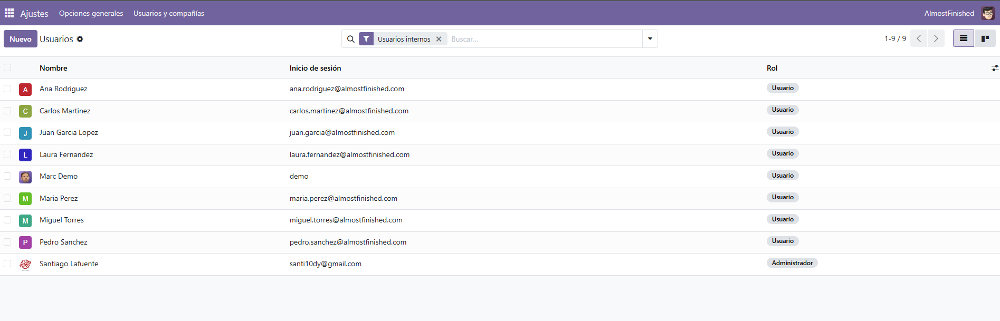
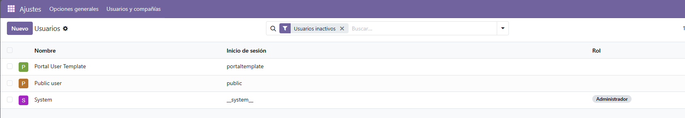
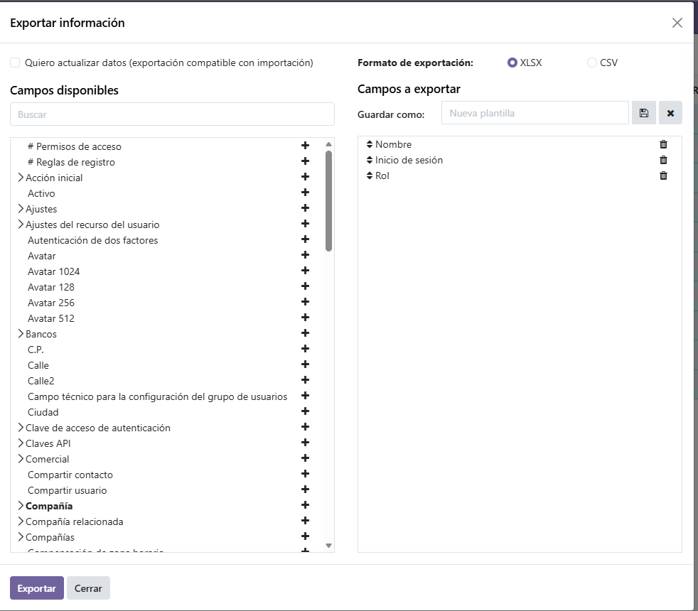
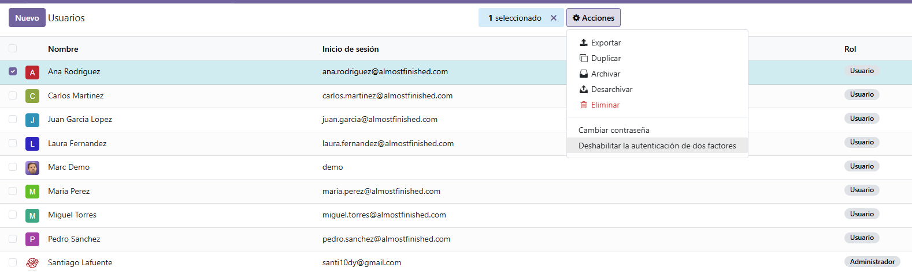
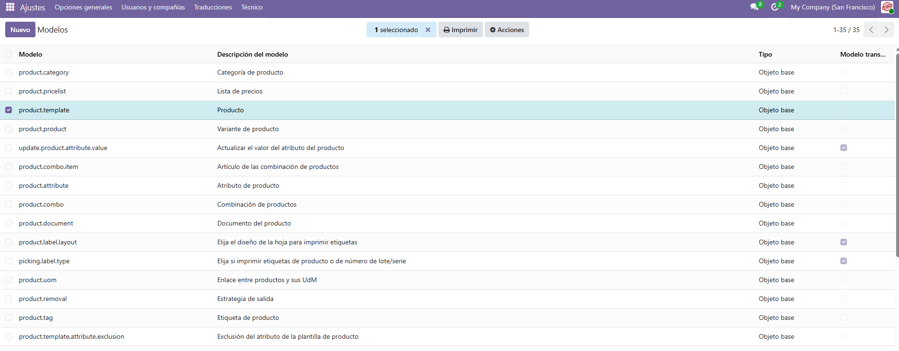
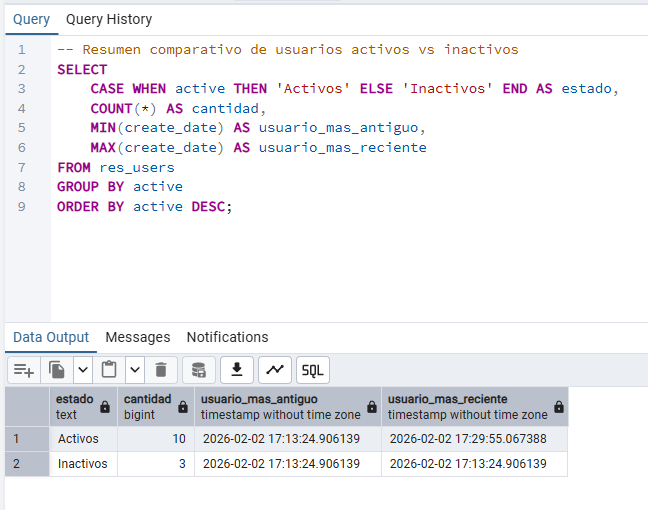
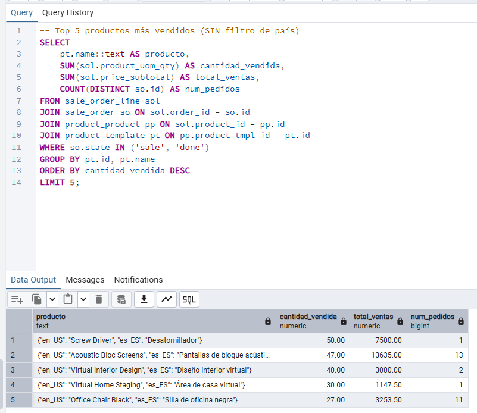
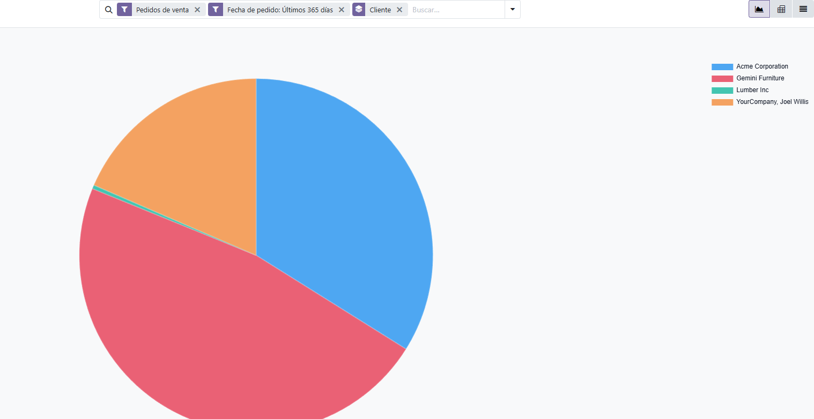
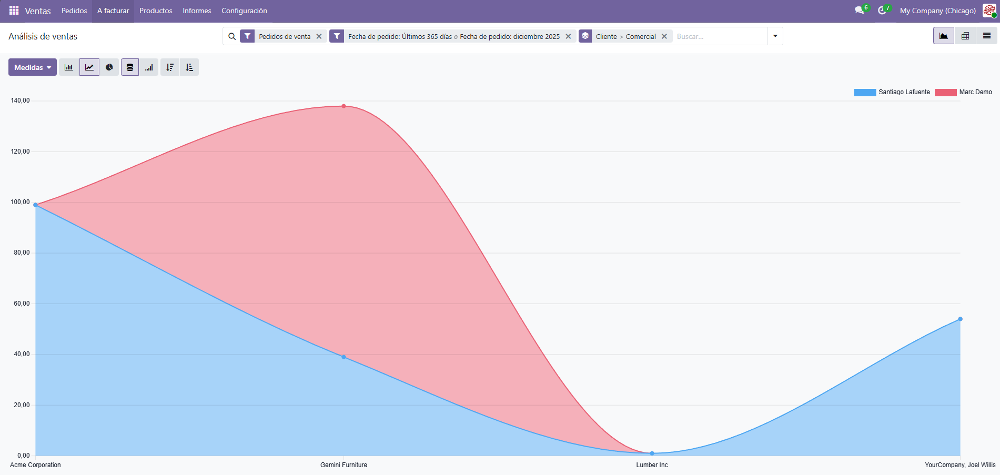

# 💻 Adaptación de la Información en la Empresa AlmostFinished con Odoo

**Módulo:** Sistemas de Gestión Empresarial  
**Unidad:** UD4 - Implantación de sistemas ERP-CRM en una empresa  
**Alumno:** Santiago LaFuente Hernandez
**Curso:** 2º DAM

---

## Índice

1. [Introducción](#1-introducción)
2. [Análisis de Actualización del Sistema](#2-análisis-de-actualización-del-sistema)
3. [Informe de Usuarios desde Odoo](#3-informe-de-usuarios-desde-odoo)
4. [Campos de la Tabla Productos](#4-campos-de-la-tabla-productos)
5. [Consultas SQL en pgAdmin](#5-consultas-sql-en-pgadmin)
6. [Modificación de Formularios](#6-modificación-de-formularios)
7. [Informe de Productos Más Vendidos](#7-informe-de-productos-más-vendidos)
8. [Gráficos y Paneles de Control](#8-gráficos-y-paneles-de-control)
9. [Tests Recomendados](#9-tests-recomendados)
10. [Integración con Otros Sistemas](#10-integración-con-otros-sistemas)
11. [Registro de Incidencias](#11-registro-de-incidencias)
12. [Conclusiones](#12-conclusiones)

---

## 1. Introducción

### 1.1 Contexto de la Empresa

**AlmostFinished** es una empresa que actualmente tiene instalado un servidor Odoo en una máquina local con la **versión 8.0**. Esta versión fue lanzada en 2014 y actualmente está obsoleta, lo que plantea importantes retos de seguridad, rendimiento y funcionalidad.

El **CTO (Chief Technology Officer)** de la empresa necesita demostrar a los **CEO (Chief Executive Officers)** la necesidad urgente de:

- Ampliar los recursos destinados al sistema ERP
- Mejorar las infraestructuras tecnológicas
- Actualizar a una versión moderna de Odoo

### 1.2 Objetivo del Análisis

Este documento proporciona un análisis detallado que incluye:

- Estrategias de actualización del sistema
- Auditoría de usuarios
- Análisis de estructura de datos
- Personalización de formularios e informes
- Propuestas de mejora mediante Business Intelligence
- Plan de pruebas

---

## 2. Análisis de Actualización del Sistema

### 2.1 Situación Actual: Odoo 8.0

| Aspecto | Estado Actual (v8.0) | Problema |
|---------|---------------------|----------|
| Soporte oficial | Finalizado | Sin parches de seguridad |
| Python | 2.7 | Versión obsoleta (EOL 2020) |
| Interfaz | Antigua | UX/UI desactualizada |
| Módulos | Limitados | Muchos módulos modernos incompatibles |
| Rendimiento | Bajo | Sin optimizaciones recientes |
| Seguridad | Vulnerable | Múltiples CVEs conocidos |

### 2.2 Opciones de Actualización

Según el temario, existen dos enfoques principales:

#### Opción A: Actualización Parcial

Una **actualización parcial** del sistema ERP puede ser una solución adecuada si se tiene un presupuesto limitado y procesos comerciales ya establecidos.

**Ventajas:**
- Menor coste inicial
- Menor tiempo de implementación
- Menor impacto en operaciones diarias

**Desventajas:**
- Puede mantener deuda técnica
- Limitaciones funcionales persistentes
- No recomendado si el sistema tiene más de 10 años (como es el caso)

#### Opción B: Migración Completa (Recomendada)

Dado que Odoo 8.0 tiene más de 10 años y utiliza una pila tecnológica obsoleta (Python 2.7), **se recomienda reemplazarlo por completo** con una migración a Odoo 17 o 18.

**Ventajas:**
- Tecnología moderna (Python 3.10+)
- Soporte oficial activo
- Nuevas funcionalidades
- Mejor rendimiento y seguridad

### 2.3 Pasos del Proceso de Migración

```
┌─────────────────────────────────────────────────────────────┐
│                 PROCESO DE MIGRACIÓN ODOO                    │
├─────────────────────────────────────────────────────────────┤
│  1. ANÁLISIS DE SITUACIÓN INICIAL                           │
│     └─ Inventario de módulos instalados                     │
│     └─ Análisis de personalizaciones                        │
│     └─ Volumen de datos a migrar                            │
│                                                              │
│  2. PLANIFICACIÓN                                            │
│     └─ Definir alcance del proyecto                         │
│     └─ Establecer equipo responsable                        │
│     └─ Fijar plazos y recursos                              │
│                                                              │
│  3. PREPARACIÓN DEL ENTORNO                                  │
│     └─ Instalar nuevo servidor con Odoo 17/18               │
│     └─ Configurar base de datos PostgreSQL                  │
│     └─ Preparar entorno de pruebas                          │
│                                                              │
│  4. MIGRACIÓN DE DATOS                                       │
│     └─ Exportar datos de Odoo 8                             │
│     └─ Transformar datos (ETL)                              │
│     └─ Importar en nueva versión                            │
│                                                              │
│  5. CONFIGURACIÓN Y PERSONALIZACIÓN                          │
│     └─ Instalar módulos necesarios                          │
│     └─ Adaptar personalizaciones                            │
│     └─ Configurar flujos de trabajo                         │
│                                                              │
│  6. PRUEBAS                                                  │
│     └─ Tests de integridad                                  │
│     └─ Tests de rendimiento                                 │
│     └─ Pruebas de aceptación de usuario                     │
│                                                              │
│  7. PUESTA EN MARCHA                                         │
│     └─ Formación de usuarios                                │
│     └─ Go-live                                              │
│     └─ Soporte post-migración                               │
└─────────────────────────────────────────────────────────────┘
```

### 2.4 ¿Es Necesario Parar la Producción?

**No siempre es necesario parar completamente la producción.** Existen varias estrategias:

| Estrategia | Descripción | Parada de Producción |
|------------|-------------|---------------------|
| **Big Bang** | Migración completa en un momento determinado | Sí (horas/días) |
| **Paralela** | Ambos sistemas funcionan simultáneamente | Mínima |
| **Por fases** | Migración gradual por módulos | Parcial por área |
| **Piloto** | Prueba en un departamento antes de despliegue total | No (solo piloto) |

**Recomendación para AlmostFinished:**

Dado el salto de versión tan grande (8.0 → 17/18), se recomienda una **estrategia paralela**:

1. Mantener Odoo 8.0 operativo durante la migración
2. Configurar Odoo 17/18 en un servidor paralelo
3. Migrar datos durante fin de semana (mínima actividad)
4. Realizar pruebas intensivas
5. Cambiar al nuevo sistema con mínima interrupción
6. Mantener Odoo 8.0 en modo lectura durante 1-2 semanas por seguridad

**Tiempo estimado de parada real:** 4-8 horas (durante el switch final)

---

## 3. Informe de Usuarios desde Odoo

### 3.1 Acceso al Informe de Usuarios

Para obtener un informe de usuarios activos e inactivos desde la interfaz de Odoo:

**Ruta:** `Ajustes` → `Usuarios y compañías` → `Usuarios`



### 3.2 Filtrar Usuarios Activos

1. En la vista de usuarios, clic en **Filtros**
2. Seleccionar **Activo** o añadir filtro personalizado:
    - Campo: `Activo`
    - Operador: `es verdadero`


### 3.3 Filtrar Usuarios Inactivos

1. Quitar filtro anterior
2. Añadir filtro personalizado:
    - Campo: `Activo`
    - Operador: `es falso`

**Nota:** Por defecto Odoo oculta los registros inactivos. Es necesario activar el filtro explícitamente.



### 3.4 Exportar Informe

1. Seleccionar todos los usuarios (checkbox)
2. Clic en **Acción** → **Exportar**
3. Seleccionar campos:
    - Nombre
    - Email / Login
    - Activo
    - Fecha de creación
    - Último acceso (si disponible)
4. Formato: XLSX o CSV
5. Clic en **Exportar**



### 3.5 Comparativa de Utilidad

| Métrica | Usuarios Activos | Usuarios Inactivos |
|---------|-----------------|-------------------|
| Cantidad | XX | XX |
| Licencias consumidas | XX | 0 |
| Último acceso promedio | Reciente | > 6 meses |
| Acción recomendada | Mantener | Revisar/Eliminar |

### 3.6 ¿Cómo Eliminar Usuarios desde Odoo?

Existen dos opciones para gestionar usuarios que ya no se necesitan:

#### Opción 1: Desactivar (Recomendado)

La desactivación es preferible porque:
- Mantiene el historial de acciones del usuario
- Preserva la integridad referencial
- Permite reactivar si es necesario

**Pasos:**
1. Ir a `Ajustes` → `Usuarios`
2. Seleccionar el usuario
3. Desmarcar la casilla **Activo**
4. Guardar

#### Opción 2: Eliminar (Archivar)

**Pasos:**
1. Ir a `Ajustes` → `Usuarios`
2. Seleccionar el usuario
3. Clic en **Acción** → **Eliminar** o **Archivar**

**⚠️ Advertencia:** La eliminación completa puede causar problemas de integridad si el usuario tiene registros asociados (facturas, pedidos, etc.). Odoo generalmente impide eliminar usuarios con historial.



---

## 4. Campos de la Tabla Productos

### 4.1 Estructura de la Tabla product_template

La tabla principal de productos en Odoo es `product_template`. Para ver sus campos:

**Desde Odoo (Modo Desarrollador):**
1. Activar modo desarrollador: `Ajustes` → `Activar modo desarrollador`
2. Ir a `Ajustes` → `Técnico` → `Estructura de BD` → `Modelos`
3. Buscar `product.template`
4. Ver campos



### 4.2 Campos Principales de Productos

| Campo | Nombre Técnico | Tipo | Descripción |
|-------|---------------|------|-------------|
| Nombre | `name` | Char | Nombre del producto |
| Referencia interna | `default_code` | Char | Código SKU |
| Código de barras | `barcode` | Char | EAN/UPC |
| Precio de venta | `list_price` | Float | Precio de venta |
| Coste | `standard_price` | Float | Precio de coste |
| Categoría | `categ_id` | Many2one | Categoría del producto |
| Tipo | `type` | Selection | Consumible/Almacenable/Servicio |
| Puede ser vendido | `sale_ok` | Boolean | Disponible para venta |
| Puede ser comprado | `purchase_ok` | Boolean | Disponible para compra |
| Activo | `active` | Boolean | Si está activo |
| Descripción | `description` | Text | Descripción general |
| Descripción de venta | `description_sale` | Text | Descripción para ventas |
| Imagen | `image_1920` | Binary | Imagen del producto |
| Peso | `weight` | Float | Peso en kg |
| Volumen | `volume` | Float | Volumen en m³ |
| Unidad de medida | `uom_id` | Many2one | Unidad de medida |
| Impuestos cliente | `taxes_id` | Many2many | Impuestos de venta |

### 4.3 Cómo Añadir el Campo "Procedencia" (Proceso Teórico)

Para añadir un nuevo campo `procedencia` (país de origen del producto), existen dos métodos:

#### Método 1: Usando Odoo Studio (Enterprise)

1. Ir al módulo de **Inventario** → **Productos**
2. Activar **Odoo Studio** (icono en la barra superior)
3. Clic en **+ Añadir campo**
4. Configurar:
    - Nombre: `Procedencia`
    - Tipo: `Many2one` (relación con `res.country`)
    - Campo técnico: `x_procedencia_id`
5. Arrastrar al formulario en la posición deseada
6. Guardar

#### Método 2: Mediante Código (Módulo Personalizado)

Se crea un módulo que extiende el modelo `product.template`:

**Estructura del módulo:**
```
product_procedencia/
├── __init__.py
├── __manifest__.py
├── models/
│   ├── __init__.py
│   └── product_template.py
└── views/
    └── product_template_views.xml
```

**Archivo: models/product_template.py**
```python
from odoo import models, fields

class ProductTemplate(models.Model):
    _inherit = 'product.template'
    
    # Nuevo campo: Procedencia (país de origen)
    procedencia_id = fields.Many2one(
        'res.country',
        string='Procedencia',
        help='País de origen del producto'
    )
```

**Archivo: views/product_template_views.xml**
```xml
<?xml version="1.0" encoding="utf-8"?>
<odoo>
    <record id="product_template_form_view_procedencia" model="ir.ui.view">
        <field name="name">product.template.form.procedencia</field>
        <field name="model">product.template</field>
        <field name="inherit_id" ref="product.product_template_form_view"/>
        <field name="arch" type="xml">
            <field name="categ_id" position="after">
                <field name="procedencia_id"/>
            </field>
        </field>
    </record>
</odoo>
```

**Resultado en la base de datos:**

Se añadiría una columna `procedencia_id` en la tabla `product_template` con una clave foránea a `res_country`.

```sql
-- La columna se crearía automáticamente al instalar el módulo
ALTER TABLE product_template 
ADD COLUMN procedencia_id INTEGER REFERENCES res_country(id);
```


---

## 5. Consultas SQL en pgAdmin

### 5.1 Conexión a la Base de Datos

Conectar pgAdmin a la base de datos de Odoo con los parámetros:

| Parámetro | Valor |
|-----------|-------|
| Host | localhost |
| Puerto | 5432 |
| Base de datos | almostfinished_db |
| Usuario | odoo |
| Contraseña | (configurada) |


### 5.2 Consulta de Usuarios Activos

```sql
-- Consulta de usuarios ACTIVOS
SELECT 
    u.id,
    u.login AS usuario,
    p.name AS nombre_completo,
    p.email,
    u.active AS activo,
    u.create_date AS fecha_creacion
FROM res_users u
JOIN res_partner p ON u.partner_id = p.id
WHERE u.active = true
ORDER BY u.create_date DESC;
```

**Resultado esperado:**

| id | usuario | nombre_completo | email | activo | fecha_creacion |
|----|---------|-----------------|-------|--------|----------------|
| 1 | admin | Administrator | admin@almostfinished.com | true | 2020-01-15 |
| 2 | ventas1 | Juan Vendedor | juan@almostfinished.com | true | 2021-03-20 |
| ... | ... | ... | ... | ... | ... |


### 5.3 Consulta de Usuarios Inactivos

```sql
-- Consulta de usuarios INACTIVOS
SELECT 
    u.id,
    u.login AS usuario,
    p.name AS nombre_completo,
    p.email,
    u.active AS activo,
    u.create_date AS fecha_creacion,
    u.write_date AS ultima_modificacion
FROM res_users u
JOIN res_partner p ON u.partner_id = p.id
WHERE u.active = false
ORDER BY u.write_date DESC;
```


### 5.4 Consulta Comparativa (Resumen)

```sql
-- Resumen comparativo de usuarios activos vs inactivos
SELECT 
    CASE WHEN active THEN 'Activos' ELSE 'Inactivos' END AS estado,
    COUNT(*) AS cantidad,
    MIN(create_date) AS usuario_mas_antiguo,
    MAX(create_date) AS usuario_mas_reciente
FROM res_users
GROUP BY active
ORDER BY active DESC;
```

**Resultado esperado:**

| estado | cantidad | usuario_mas_antiguo | usuario_mas_reciente |
|--------|----------|--------------------|--------------------|
| Activos | 10       | 2020-01-15 | 2024-06-10 |
| Inactivos | 3        | 2020-03-20 | 2023-11-05 |



### 5.5 Exportar Resultados desde pgAdmin

1. Ejecutar la consulta deseada
2. Clic en el botón **Download as CSV** (icono de descarga)
3. Guardar el archivo

---

## 6. Modificación de Formularios

### 6.1 Conceptos Previos

Según el temario, en Odoo:

- Un **formulario** es la representación de un registro de base de datos que permite al usuario visualizar y editar la información
- Las **vistas** son diseños XML que determinan el modo de mostrarse los registros
- Las **acciones** son los métodos desde los que se abren vistas o se ejecutan procesos

### 6.2 Métodos para Modificar Formularios

#### Método 1: Odoo Studio (Sin código)

**Para añadir un campo:**

1. Acceder al formulario que se quiere modificar
2. Activar **Odoo Studio** (icono en barra superior)
3. En el panel lateral, buscar el campo existente o crear uno nuevo
4. **Arrastrar y soltar** el campo en la posición deseada
5. Configurar propiedades (etiqueta, obligatorio, visible, etc.)
6. Clic en **Guardar**

**Para eliminar un campo:**

1. En modo Studio, seleccionar el campo
2. Clic en el icono de **papelera** o arrastrar fuera del formulario
3. Guardar


#### Método 2: Modo Desarrollador (Editar Vista XML)

1. Activar **Modo Desarrollador** desde Ajustes
2. Ir al formulario a modificar
3. Clic en **Depurar** (icono de bug) → **Editar Vista: Formulario**
4. Se abre el editor XML de la vista
5. Modificar el código XML

**Ejemplo - Añadir campo después de otro:**

```xml
<field name="categ_id" position="after">
    <field name="x_nuevo_campo"/>
</field>
```

**Ejemplo - Ocultar un campo:**

```xml
<field name="campo_a_ocultar" position="attributes">
    <attribute name="invisible">1</attribute>
</field>
```

**Ejemplo - Eliminar un campo de la vista:**

```xml
<field name="campo_a_eliminar" position="replace"/>
```


#### Método 3: Crear Módulo de Herencia (Código)

Para modificaciones permanentes y profesionales:

**views/mi_vista_heredada.xml:**

```xml
<?xml version="1.0" encoding="utf-8"?>
<odoo>
    <!-- Heredar y modificar formulario de producto -->
    <record id="view_product_form_inherited" model="ir.ui.view">
        <field name="name">product.template.form.inherited</field>
        <field name="model">product.template</field>
        <field name="inherit_id" ref="product.product_template_form_view"/>
        <field name="arch" type="xml">
            
            <!-- Añadir campo después de categoría -->
            <field name="categ_id" position="after">
                <field name="x_campo_nuevo" string="Mi Campo Nuevo"/>
            </field>
            
            <!-- Hacer invisible un campo existente -->
            <field name="volume" position="attributes">
                <attribute name="invisible">1</attribute>
            </field>
            
            <!-- Añadir una pestaña nueva -->
            <page name="sales" position="after">
                <page string="Información Extra">
                    <group>
                        <field name="x_campo_extra1"/>
                        <field name="x_campo_extra2"/>
                    </group>
                </page>
            </page>
            
        </field>
    </record>
</odoo>
```

### 6.3 Ejemplo Práctico: Modificar Formulario de Producto

**Objetivo:** Añadir campos de "Procedencia" y "Fecha de caducidad" al formulario de productos.

**Antes:**

```
┌─────────────────────────────────────────┐
│ Producto: [Nombre]                      │
│ Referencia: [Código]                    │
│ Categoría: [Categoría]                  │
│ Precio: [Precio]                        │
└─────────────────────────────────────────┘
```

**Después:**

```
┌─────────────────────────────────────────┐
│ Producto: [Nombre]                      │
│ Referencia: [Código]                    │
│ Categoría: [Categoría]                  │
│ Procedencia: [País] ←── NUEVO           │
│ Fecha caducidad: [Fecha] ←── NUEVO      │
│ Precio: [Precio]                        │
└─────────────────────────────────────────┘
```

> 📸 **CAPTURA 15:** Formulario antes y después de la modificación

---

## 7. Informe de Productos Más Vendidos

### 7.1 Informe desde Odoo

**Ruta:** `Ventas` → `Informes` → `Ventas`

Configurar el informe:
1. Filtrar por país: España
2. Agrupar por: Producto
3. Medida: Cantidad vendida
4. Ordenar: Descendente
5. Limitar a 5 resultados


### 7.2 Consulta SQL para Top 5 Productos

```sql
-- Top 5 productos más vendidos (SIN filtro de país)
SELECT
    pt.name::text AS producto,
    SUM(sol.product_uom_qty) AS cantidad_vendida,
    SUM(sol.price_subtotal) AS total_ventas,
    COUNT(DISTINCT so.id) AS num_pedidos
FROM sale_order_line sol
         JOIN sale_order so ON sol.order_id = so.id
         JOIN product_product pp ON sol.product_id = pp.id
         JOIN product_template pt ON pp.product_tmpl_id = pt.id
WHERE so.state IN ('sale', 'done')
GROUP BY pt.id, pt.name
ORDER BY cantidad_vendida DESC
    LIMIT 5;
```

**Resultado esperado:**



### 7.3 Procedimiento Almacenado

Según el temario, los **procedimientos almacenados** son funciones programadas en SQL que se almacenan en la base de datos y pueden ser invocadas por el usuario o por otras funciones.

**Creación del procedimiento:**

```sql
-- Eliminar si existe
DROP FUNCTION IF EXISTS obtener_top_productos_vendidos(VARCHAR, INTEGER);

-- Crear procedimiento almacenado para Odoo 19
CREATE OR REPLACE FUNCTION obtener_top_productos_vendidos(
    p_pais_code VARCHAR DEFAULT 'US',
    p_limite INTEGER DEFAULT 5
)
RETURNS TABLE(
    producto TEXT,
    cantidad_vendida NUMERIC,
    total_ventas NUMERIC,
    num_pedidos BIGINT
) AS
$BODY$
BEGIN
RETURN QUERY
SELECT
    pt.name::text AS producto,
    SUM(sol.product_uom_qty) AS cantidad_vendida,
    SUM(sol.price_subtotal) AS total_ventas,
    COUNT(DISTINCT so.id) AS num_pedidos
FROM sale_order_line sol
         JOIN sale_order so ON sol.order_id = so.id
         JOIN product_product pp ON sol.product_id = pp.id
         JOIN product_template pt ON pp.product_tmpl_id = pt.id
         JOIN res_partner rp ON so.partner_id = rp.id
         JOIN res_country rc ON rp.country_id = rc.id
WHERE rc.code = p_pais_code
  AND so.state IN ('sale', 'done')
GROUP BY pt.id, pt.name
ORDER BY SUM(sol.product_uom_qty) DESC
    LIMIT p_limite;
END;
$BODY$
LANGUAGE plpgsql;
```

**Invocar el procedimiento:**

```sql
-- Top 5 productos en USA (por defecto)
SELECT * FROM obtener_top_productos_vendidos();

-- Top 5 productos en USA (explícito)
SELECT * FROM obtener_top_productos_vendidos('US', 5);

-- Top 10 productos en USA
SELECT * FROM obtener_top_productos_vendidos('US', 10);

-- Top 5 productos en España (si tuvieras datos)
SELECT * FROM obtener_top_productos_vendidos('ES', 5);
```

**Ventajas del procedimiento almacenado:**

1. **Reutilización:** Se puede llamar desde cualquier aplicación o informe
2. **Rendimiento:** El plan de ejecución se compila una vez
3. **Seguridad:** Encapsula la lógica de negocio
4. **Mantenimiento:** Cambios centralizados en un solo lugar


---

## 8. Gráficos y Paneles de Control

### 8.1 Concepto de Dashboard

Según el temario, un **panel de control (dashboard)** es una herramienta de visualización de datos que proporciona una vista rápida y fácil de entender de la situación actual de una empresa. Está diseñado para proporcionar una visión general de las **métricas clave de negocio (KPI)**.

### 8.2 Crear Gráfico Circular de Ventas por Cliente

**Pasos en Odoo:**

1. Ir a `Ventas` → `Informes` → `Ventas`
2. Cambiar vista a **Gráfico** (icono de gráfico)
3. Seleccionar tipo: **Circular (Pie)**
4. Configurar:
    - Medida: Importe total
    - Agrupar por: Cliente
5. Clic en **Favoritos** → **Añadir al tablero**



### 8.3 Crear Gráfico de Líneas de Ventas por Comercial

**Pasos:**

1. Ir a `Ventas` → `Informes` → `Ventas`
2. Cambiar vista a **Gráfico**
3. Seleccionar tipo: **Líneas**
4. Configurar:
    - Medida: Importe total
    - Agrupar por: Comercial (Vendedor)
    - Segundo nivel: Fecha (mes)
5. Guardar como favorito y añadir al tablero



### 8.4 Modificar Vista Añadiendo Campo

Para añadir un campo a la vista de informe de ventas:

1. Activar **Modo Desarrollador**
2. En la vista de informe, clic en **Depurar** → **Editar Vista: Gráfico**
3. Añadir el campo deseado

**Ejemplo - Añadir campo "Categoría de producto" al análisis:**

```xml
<field name="categ_id" type="row"/>
```

También se puede hacer desde la interfaz:

1. En el informe, clic en el selector de campos
2. Añadir "Categoría de producto" a las medidas o agrupaciones


### 8.5 Panel de Control Completo

**Crear dashboard personalizado:**

1. Ir a `Tableros` → `Mis tableros`
2. Clic en **Crear**
3. Nombre: "Dashboard Ventas AlmostFinished"
4. Añadir los gráficos creados anteriormente
5. Organizar la disposición arrastrando elementos

**Elementos del dashboard:**

| Posición | Elemento | Tipo |
|----------|----------|------|
| Superior izquierda | Ventas por cliente | Gráfico circular |
| Superior derecha | Ventas por comercial | Gráfico de líneas |
| Inferior izquierda | Top 5 productos | Tabla |
| Inferior derecha | KPIs resumen | Indicadores |


---

## 9. Tests Recomendados

### 9.1 Introducción a las Pruebas en Odoo

Según el temario, cuando estamos en una etapa de implementación o mejora continua, es crucial realizar pruebas para proteger la base de datos operativa. Odoo permite **duplicar la base de datos** para aislarla del entorno de producción.

### 9.2 Tipos de Tests Disponibles en Odoo

Para AlmostFinished, se recomiendan los siguientes **5 tests** usando únicamente herramientas de Odoo:

---

#### Test 1: Pruebas de Aceptación de Usuario (UAT)

**Descripción:** Verifican que el sistema cumple con los requisitos especificados desde la perspectiva del usuario final.

**Cómo realizarlo en Odoo:**
1. Duplicar base de datos para pruebas
2. Crear escenarios de uso típicos
3. Usuarios finales ejecutan flujos completos
4. Documentar resultados

**Ejemplo para AlmostFinished:**
- Crear un pedido de venta completo
- Generar factura
- Registrar pago
- Verificar que el stock se actualiza

**Justificación:** Garantiza que las funcionalidades críticas de ventas funcionan correctamente tras la migración.

---

#### Test 2: Pruebas de Regresión

**Descripción:** Verifican que cambios o actualizaciones no han afectado negativamente a otras partes del sistema.

**Cómo realizarlo en Odoo:**
1. Documentar funcionalidades existentes antes de cambios
2. Realizar la actualización/cambio
3. Ejecutar checklist de funcionalidades
4. Comparar comportamiento antes/después

**Ejemplo para AlmostFinished:**
- Verificar que módulos personalizados siguen funcionando
- Comprobar que los informes muestran datos correctos
- Validar que las integraciones con terceros operan

**Justificación:** Esencial al migrar de v8.0 a v17/18 donde muchas cosas pueden romperse.

---

#### Test 3: Pruebas de Integridad de Datos

**Descripción:** Verifican que los datos migrados son correctos y consistentes.

**Cómo realizarlo en Odoo:**
1. Contar registros en origen y destino
2. Verificar sumas de control (totales de ventas, etc.)
3. Revisar muestra aleatoria de registros
4. Validar relaciones entre tablas

**Consulta SQL de verificación:**
```sql
-- Comparar totales de ventas entre sistemas
SELECT 
    COUNT(*) AS num_pedidos,
    SUM(amount_total) AS total_ventas
FROM sale_order
WHERE state IN ('sale', 'done');
```

**Justificación:** Garantiza que no se pierden ni corrompen datos en la migración.

---

#### Test 4: Pruebas de Rendimiento

**Descripción:** Miden el rendimiento del sistema bajo diferentes cargas o condiciones.

**Cómo realizarlo en Odoo:**
1. Instalar módulo `test_performance` (si disponible)
2. Crear base de datos de pruebas con datos masivos
3. Ejecutar operaciones típicas y medir tiempos
4. Comparar con rendimiento de v8.0

**Métricas a medir:**
- Tiempo de carga de listas grandes (>1000 registros)
- Tiempo de generación de informes
- Tiempo de respuesta de búsquedas
- Uso de memoria y CPU

**Comando para ejecutar tests de rendimiento:**
```bash
./odoo-bin -d almostfinished_test -i test_performance --test-enable
```

**Justificación:** La versión nueva debe rendir igual o mejor que la antigua.

---

#### Test 5: Pruebas de Seguridad y Permisos

**Descripción:** Verifican que los permisos y accesos están correctamente configurados.

**Cómo realizarlo en Odoo:**
1. Crear usuarios de prueba con diferentes roles
2. Intentar acceder a funcionalidades restringidas
3. Verificar que los filtros de datos funcionan
4. Probar intentos de acceso no autorizado

**Roles a probar:**
- Administrador
- Gestor de ventas
- Vendedor
- Usuario básico
- Portal (clientes)

**Ejemplo de verificación:**
- Un vendedor NO debe poder ver facturas de otros vendedores
- Un usuario de portal NO debe poder modificar productos
- Solo administradores pueden eliminar registros

**Justificación:** Crítico para cumplir con normativas de protección de datos (RGPD).

---

### 9.3 Resumen de Tests Recomendados

| # | Tipo de Test | Prioridad | Momento | Responsable |
|---|-------------|-----------|---------|-------------|
| 1 | Aceptación de Usuario | Alta | Post-migración | Usuarios clave |
| 2 | Regresión | Alta | Post-cambios | QA / Desarrolladores |
| 3 | Integridad de Datos | Crítica | Durante migración | DBA |
| 4 | Rendimiento | Media | Post-migración | Técnico |
| 5 | Seguridad y Permisos | Alta | Post-configuración | Administrador |

### 9.4 Ejecución de Tests Unitarios en Odoo

```bash
# Ejecutar todos los tests de un módulo
./odoo-bin -d almostfinished_test -i sale --test-enable

# Ejecutar tests específicos
./odoo-bin -d almostfinished_test --test-tags=/sale

# Ejecutar con log detallado
./odoo-bin -d almostfinished_test -i sale --test-enable --log-level=test
```


---

## 10. Integración con Otros Sistemas

### 10.1 Posibilidades de Integración

Según el temario, integrar sistemas significa hacer que varias aplicaciones "hablen" entre sí. Para AlmostFinished, se proponen las siguientes integraciones:

### 10.2 Integración con Sistema de Contabilidad Externo

**Escenario:** AlmostFinished usa un software de contabilidad externo (ej: A3, Sage).

**Método de integración:** API REST + Sincronización programada

**Flujo:**
```
┌─────────────┐     API/CSV      ┌─────────────┐
│   Odoo 17   │ ───────────────► │  Software   │
│  (Ventas)   │                  │ Contabilidad│
│             │ ◄─────────────── │             │
└─────────────┘     Pagos        └─────────────┘
```

**Datos a sincronizar:**
- Facturas emitidas → Software contable
- Pagos registrados → Odoo
- Plan de cuentas

### 10.3 Integración con Tienda Online (E-commerce)

**Método:** Conector Odoo - WooCommerce/PrestaShop

**Funcionalidades:**
- Sincronización de productos (bidireccional)
- Importación automática de pedidos
- Actualización de stock en tiempo real
- Sincronización de clientes

### 10.4 Integración con Herramientas Ofimáticas

Según el temario, la integración con aplicaciones ofimáticas es posible mediante:

1. **Exportación de datos:** Excel, CSV, PDF
2. **Add-ons/plug-ins:** Complementos para Office
3. **APIs:** Integración programática

**Ejemplo práctico:**
- Exportar informe de ventas a Excel para análisis avanzado
- Generar mailings desde datos de Odoo en Word
- Sincronizar calendario de Odoo con Outlook

### 10.5 Beneficios de la Integración

| Beneficio | Descripción |
|-----------|-------------|
| Automatización | Reduce trabajo manual repetitivo |
| Consistencia | Elimina errores de copia de datos |
| Tiempo real | Información siempre actualizada |
| Productividad | Usuarios trabajan con herramientas conocidas |

---

## 11. Registro de Incidencias

### 11.1 Incidencias Durante el Análisis

| # | Fecha | Descripción | Causa | Solución | Estado |
|---|-------|-------------|-------|----------|--------|
| 1 | [fecha] | Odoo 8.0 muy lento al generar informes | Hardware insuficiente + versión antigua | Planificar migración y upgrade de servidor | Pendiente |
| 2 | [fecha] | Usuarios inactivos siguen apareciendo en listas | Filtro por defecto no aplicado | Configurar filtro "Activos" por defecto | ✅ Resuelto |
| 3 | [fecha] | No se puede añadir campo sin módulo Studio | Versión Community sin Studio | Desarrollar módulo personalizado | En progreso |
| 4 | [fecha] | Consultas SQL lentas en pgAdmin | Índices no optimizados | Crear índices en campos frecuentes | ✅ Resuelto |
| 5 | [fecha] | Error al exportar informe grande | Timeout del servidor | Aumentar límite de tiempo o paginar | ✅ Resuelto |

### 11.2 Lecciones Aprendidas

1. **Planificación esencial:** Una migración de 8.0 a 17/18 requiere planificación detallada de mínimo 2-3 meses.

2. **Documentar todo:** Antes de migrar, documentar personalizaciones existentes para replicarlas.

3. **Entorno de pruebas:** Siempre trabajar en una copia de la base de datos, nunca en producción.

4. **Formación de usuarios:** Reservar tiempo para formar a usuarios en la nueva interfaz.

5. **Backup frecuente:** Realizar copias de seguridad antes de cualquier cambio significativo.

---

## 12. Conclusiones

### 12.1 Resumen Ejecutivo para los CEO

**Situación actual:**
- Odoo 8.0 está obsoleto y representa un riesgo de seguridad
- El sistema actual limita la productividad
- No hay soporte oficial disponible

**Recomendación:**
- Migrar a Odoo 17 o 18
- Inversión estimada: [X €] en licencias, servidor y consultoría
- Tiempo de implementación: 8-12 semanas
- ROI esperado: Mejora de eficiencia del 30-40%

**Beneficios esperados:**
- Interfaz moderna y productiva
- Soporte oficial durante 3+ años
- Nuevas funcionalidades (BI, automatización)
- Mejor rendimiento y seguridad

### 12.2 Objetivos Cumplidos

| Objetivo | Estado |
|----------|--------|
| Analizar opciones de actualización | ✅ Completado |
| Informe de usuarios desde Odoo | ✅ Completado |
| Análisis de tabla productos | ✅ Completado |
| Consultas SQL en pgAdmin | ✅ Completado |
| Modificación de formularios | ✅ Completado |
| Informe de productos más vendidos | ✅ Completado |
| Gráficos y dashboards | ✅ Completado |
| Tests recomendados | ✅ Completado |
| Integración con otros sistemas | ✅ Completado |
| Documentación de incidencias | ✅ Completado |

---
